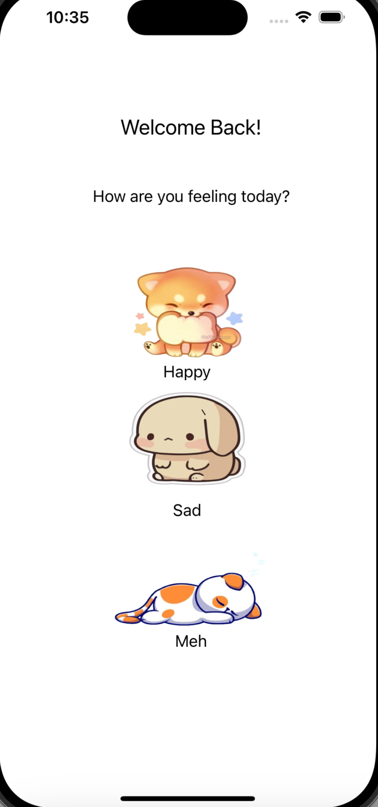
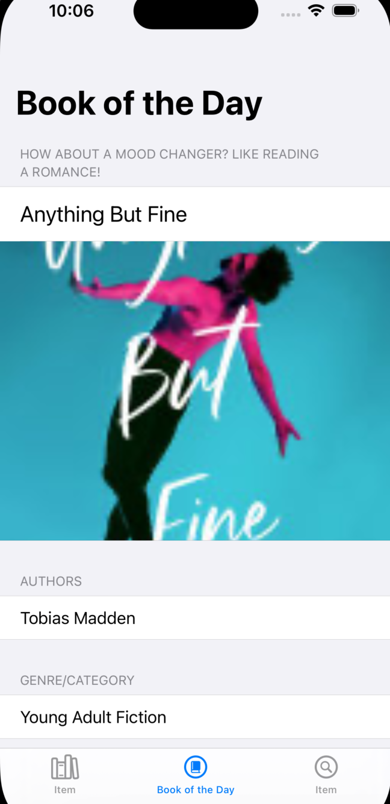
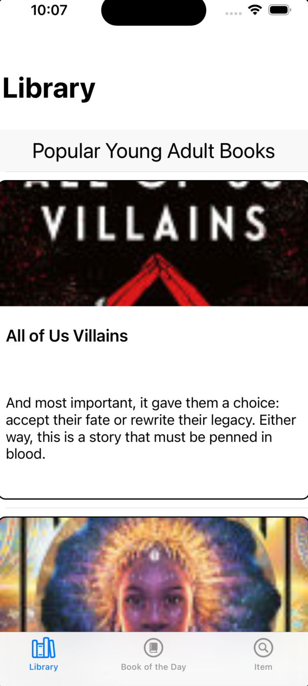
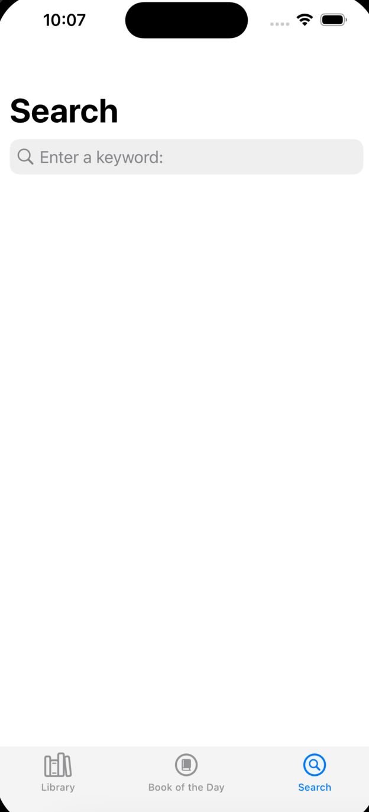
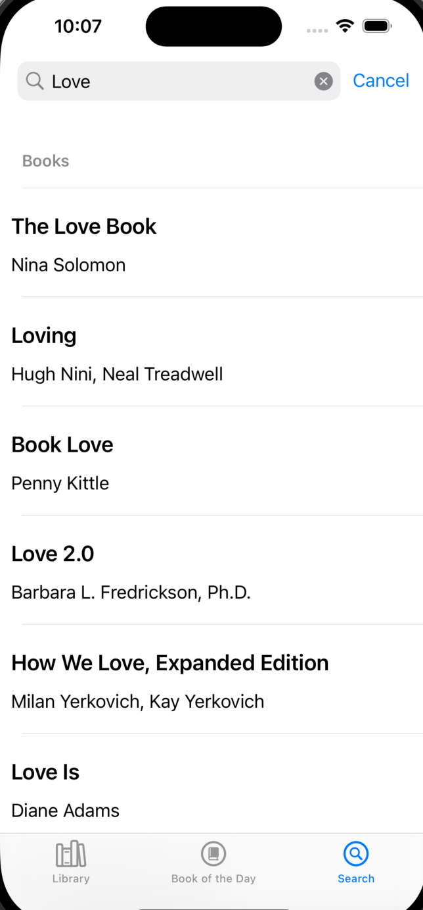
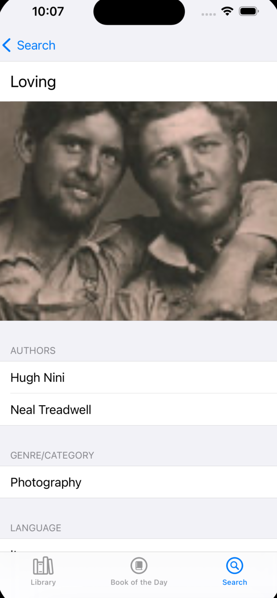
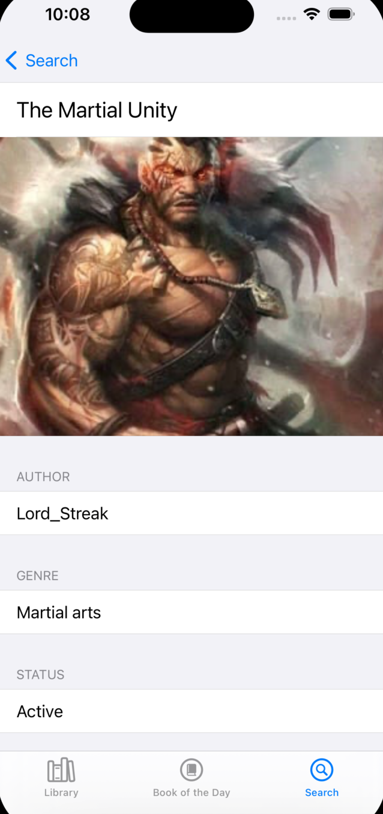
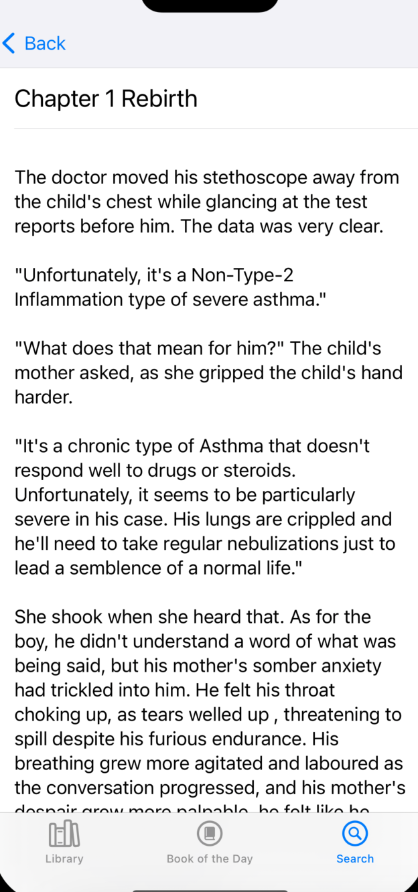
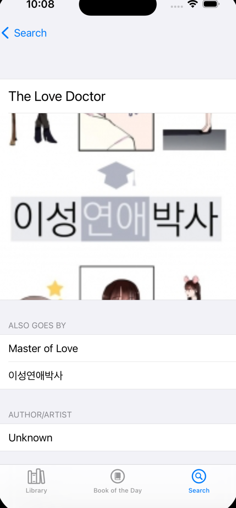
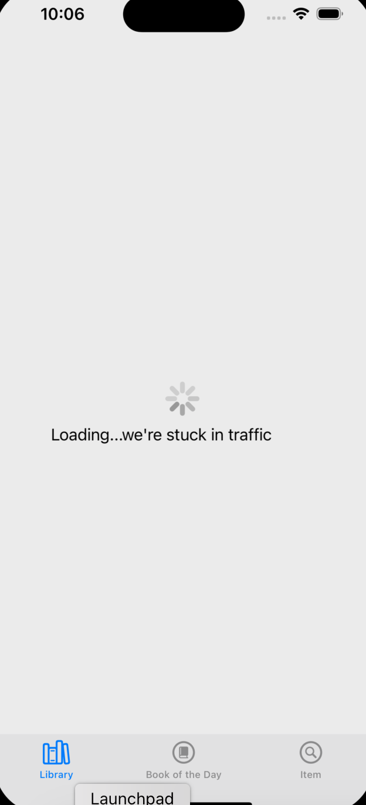

# CSCI-39537-Final-Project
I am creating an iOS project that allows users to browse books from all over the world

## APIs Used

### [Google Books API](https://developers.google.com/books/docs/v1/using)
Google Books API was used to get a list of popular young adult novels and it is also one of the largest libraries for all kinds of books

#### Endpoints Used
```
https://www.googleapis.com/books/v1/volumes?q="keyword"
```
* A get endpoint that returns 10 books based on the keyword
```
https://www.googleapis.com/books/v1/volumes?q=subject:"genre"
```
* A get endpoint that returns 10 books with the specific genre

### [Kitsu API](https://pages.github.com/)
Kitsu API is one of the few free manga and anime APIs that I found

#### Endpoints Used
```
https://www.googleapis.com/books/v1/volumes?q="keyword"
```
* A get endpoint that returns 10 books based on the keyword
```
https://kitsu.io/api/edge/manga?page[limit]=10&page[offset]=0
```
* A get endpoint that returns a random list of 10 mangas

### [Web Novel API](https://rapidapi.com/sharyt26shar/api/webnovel/)
A free rest API on RapidAPI that returns information on certain light novels and allows the user or read them

#### Endpoints Used
```
https://webnovel.p.rapidapi.com/novels/1
```
* A get endpoint that returns 100 web novels
```
https://webnovel.p.rapidapi.com/novel/id
```
* A get endpoint that returns the information for a specific novel specified by its id
```
https://webnovel.p.rapidapi.com/novel/\(novel.id)/\(chapter.url!)
```
* A get endpoint that returns the information for a chapter of the novel, allowing the user to read it

### Demo

#### First Page

This is first page that allows users to choose an emotion and a book will be recommended based on the emotion chosen

**Limitations:**
Styling of this page could have been better

#### Book of Day

Recommends a book to the user

**Limitations:**
Books will only be chosen from Google Books API as calls to the other 2 APIs take way to much time

#### Library

Lists of books, web novels and manga, each section has 10 items

**Limitations:**
Takes time to load because 3 APIs are being called and more work was implemented here so there would not be any delay when user clicks on the details of each item

#### Search

A search page allowing users to look for certain books, light novels or mangas

**Limitations:**
Takes time to load because 3 APIs are being called

#### Search Results

How the search page returns results

**Limitations:**
Lightnovel section will return no results if the library page has not yet loaded

#### Book Details

Example of the details page for a book

#### Lightnovel Details

Example of the details page for a web novel

#### Chapter Page

Displays the content of a chapter of the web novel, allowing user to read it

#### Manga Details

Example of the details page for a manga

**Limitations:**
Some sections may have blank cells as not all possible combinations of other titles, genre, and authors was tested

#### Loading Page

Shows a loading page as data may take some time to show
